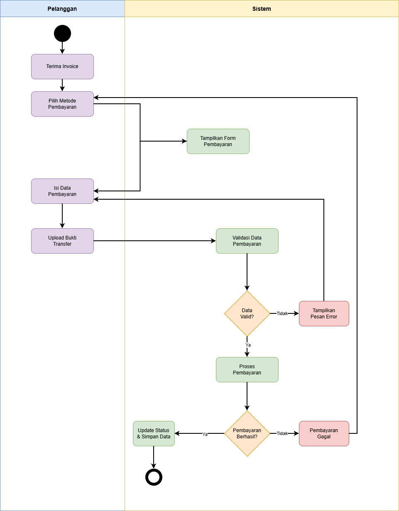
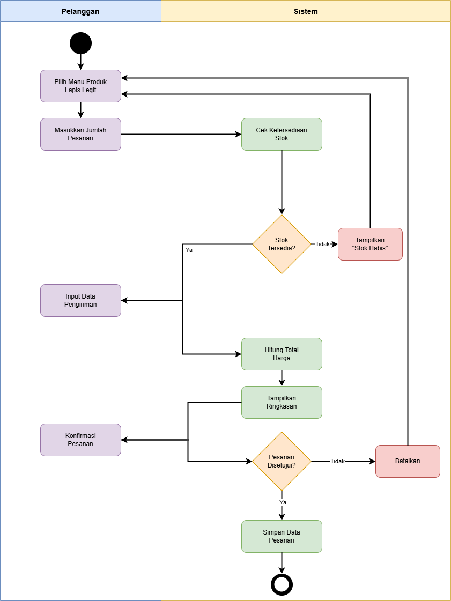
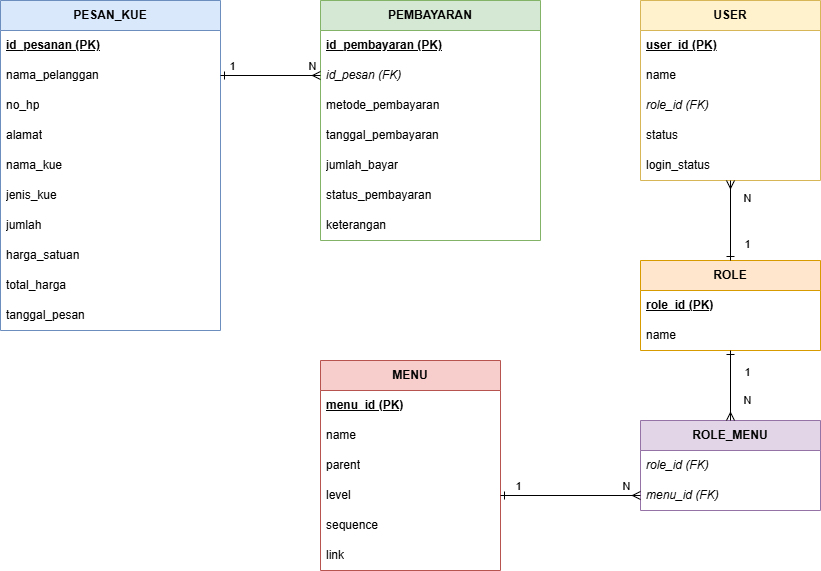
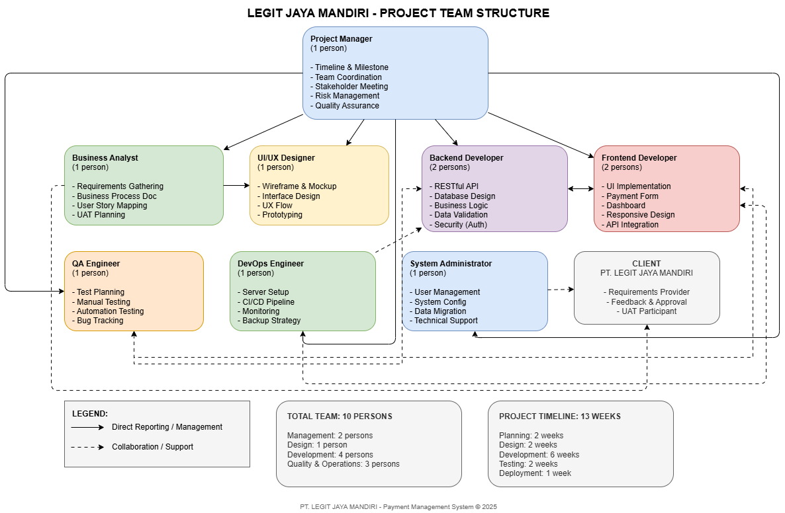
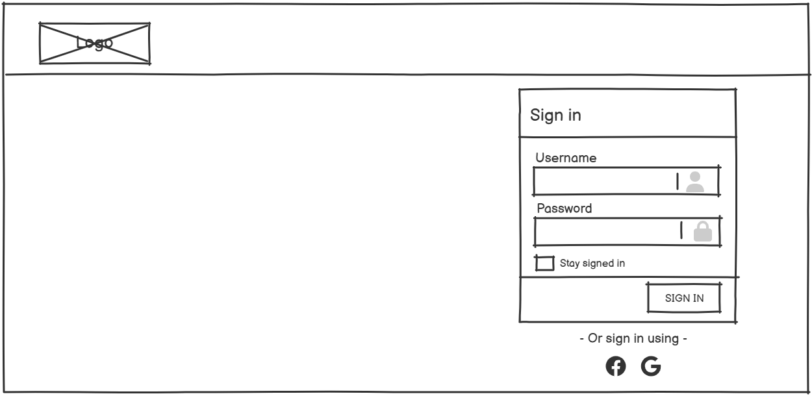
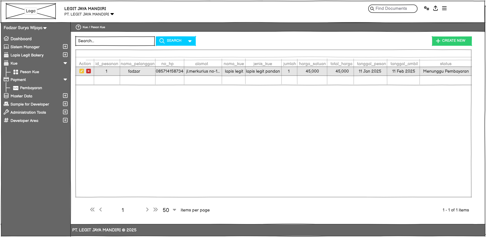
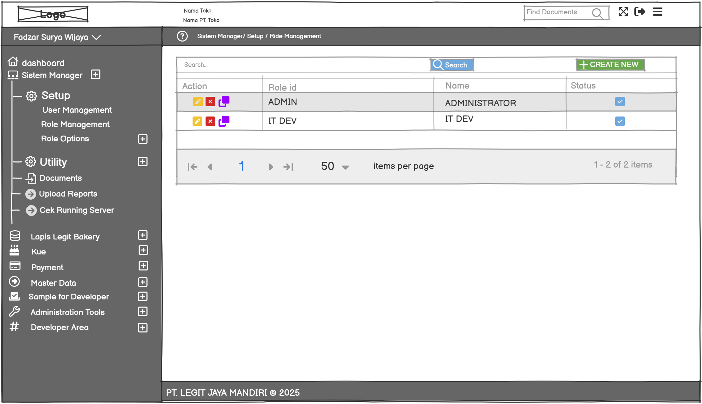
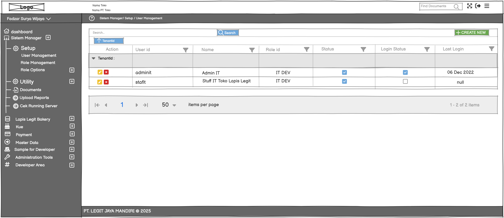

# **README — Sistem Manajemen Lapis Legit**

**PT. LEGIT JAYA MANDIRI**

## **📌 Informasi Proyek**

| Keterangan          | Detail                                |
| ------------------- | ------------------------------------- |
| **Nama Mahasiswa**  | Fadzar Surya Wijaya                   |
| **NIM**             | 312310451                             |
| **Mata Kuliah**     | Pemrograman Visual Desktop            |
| **Dosen Pengampu**  | Dr. Muhammad Fatchan, S.Kom., M.Kom    |
| **Nama Project**    | Sistem Manajemen Lapis Legit |
| **Nama Perusahaan** | PT. LEGIT JAYA MANDIRI                |

---

## **🎯 Deskripsi Singkat Proyek**

Sistem ini dirancang untuk mengelola proses pembayaran pesanan roti di toko **PT. LEGIT JAYA MANDIRI** secara terstruktur, otomatis, dan mudah digunakan. Sistem menyediakan kemudahan dalam:

* Input data pesanan kue
* Pengelolaan transaksi pembayaran
* Validasi bukti pembayaran
* Pelacakan status pesanan secara real-time
* Penyimpanan data customer dan laporan audit

---

## **🧠 Alasan Memilih Proyek**

1. **Efisiensi Operasional** — Mengurangi pekerjaan manual dan human error.
2. **Transparansi Data Keuangan** — Menyimpan seluruh histori pembayaran dengan jelas.
3. **Mendukung Banyak Metode Pembayaran** — Cash, Transfer, Debit.
4. **Integrasi Data Customer & Pembayaran** — Memudahkan rekonsiliasi dan pelaporan.
5. **Validasi Otomatis Pembayaran** — Mengurangi risiko kesalahan dan penipuan.
6. **Audit Trail Lengkap** — Semua transaksi tersimpan.
7. **Scalable** — Bisa dikembangkan untuk banyak cabang di masa depan.

---

## **🔧 Konfigurasi Web Service**

Tutorial konfigurasi Web Service ASP.NET dapat dilihat pada link berikut: 
**[https://youtu.be/Iz-drKCBMvk?si=n2FyeX_e5FCvdw5S](https://youtu.be/Iz-drKCBMvk?si=n2FyeX_e5FCvdw5S)**

---

## **📈 Business Process (Alur Sistem Pembayaran)**

### **1. Activity Diagram PEMBAYARAN**

### **2. Activity Diagram PESAN_KUE**

---

## **🗄️ Model Data (Database ERD Overview)**

### **1. Tabel PESAN_KUE**

| Kolom               | Keterangan                                  |
| ------------------- | ------------------------------------------- |
| **id_pesanan (PK)** | ID unik untuk setiap pesanan                |
| nama_pelanggan      | Nama pelanggan yang memesan                 |
| no_hp               | Nomor telepon pelanggan                     |
| alamat              | Alamat pemesan / pengiriman                 |
| nama_kue            | Nama kue yang dipesan                       |
| jenis_kue           | Jenis / kategori kue                        |
| jumlah              | Jumlah pesanan                              |
| harga_satuan        | Harga per unit kue                          |
| total_harga         | Total biaya pesanan (jumlah × harga_satuan) |
| tanggal_pesan       | Tanggal pelanggan melakukan pemesanan       |

### **2. Tabel PEMBAYARAN**

| Kolom                  | Keterangan                                   |
| ---------------------- | -------------------------------------------- |
| **id_pembayaran (PK)** | ID unik transaksi pembayaran                 |
| **id_pesan (FK)**      | Mengacu ke pesanan di PESAN_KUE              |
| metode_pembayaran      | Cash / Transfer / Debit                      |
| tanggal_pembayaran     | Waktu pembayaran dilakukan                   |
| jumlah_bayar           | Nominal yang dibayarkan                      |
| status_pembayaran      | Status pembayaran (sukses / pending / gagal) |
| keterangan             | Catatan tambahan (opsional)                  |

### **3. Tabel USER**

| Kolom            | Keterangan                         |
| ---------------- | ---------------------------------- |
| **user_id (PK)** | ID unik pengguna sistem            |
| name             | Nama pengguna                      |
| **role_id (FK)** | Mengacu ke jenis role (tabel ROLE) |
| status           | Status akun (aktif / non-aktif)    |
| login_status     | Status login terbaru pengguna      |

### **4. Tabel ROLE**

| Kolom            | Keterangan                          |
| ---------------- | ----------------------------------- |
| **role_id (PK)** | ID unik level role / hak akses      |
| name             | Nama peran (ADMIN / STAFF / IT DEV) |

### **5. Tabel MENU**

| Kolom            | Keterangan                              |
| ---------------- | --------------------------------------- |
| **menu_id (PK)** | ID unik menu                            |
| name             | Nama menu                               |
| parent           | Parent menu (untuk sub-menu / hierarki) |
| level            | Level struktur menu                     |
| sequence         | Urutan tampilan menu                    |
| link             | URL/route menu dalam aplikasi           |

### **6. Tabel ROLE MENU**

| Kolom            | Keterangan            |
| ---------------- | --------------------- |
| **role_id (FK)** | Mengacu ke tabel ROLE |
| **menu_id (FK)** | Mengacu ke tabel MENU |
Relasi:
- Satu ROLE dapat memiliki akses ke banyak MENU

- Satu MENU dapat digunakan oleh banyak ROLE
  → Relasi Many-to-Many melalui tabel ROLE_MENU

### **Ringkasan Relasi**  

| Relasi                 | Jenis                       | Keterangan                                   |
| ---------------------- | --------------------------- | -------------------------------------------- |
| PESAN_KUE → PEMBAYARAN | **1 : N**                   | Satu pesanan dapat dibayar lebih dari sekali |
| ROLE → USER            | **1 : N**                   | Satu role dapat dimiliki banyak user         |
| ROLE ↔ MENU            | **N : N** via **ROLE_MENU** | Hak akses menu berdasarkan role              |

---

## **👥 Skema Tim Pengembangan**

| Role / Posisi            | Tanggung Jawab Utama                                                                                       |
| ------------------------ | ---------------------------------------------------------------------------------------------------------- |
| **Project Manager**      | Mengelola timeline, koordinasi tim, komunikasi dengan stakeholder, dan pengawasan kualitas proyek.         |
| **Business Analyst**     | Melakukan analisis kebutuhan sistem, membuat dokumentasi proses bisnis, dan menjembatani client & tim dev. |
| **UI/UX Designer**       | Mendesain tampilan antarmuka, alur interaksi pengguna, dan membuat prototipe visual sistem.                |
| **Backend Developer**    | Mengembangkan API, mengelola database, menjalankan logika bisnis, serta memastikan keamanan sistem.        |
| **Frontend Developer**   | Membangun tampilan antarmuka pengguna, menghubungkan UI dengan API, serta memastikan responsivitas sistem. |
| **QA Engineer**          | Melakukan pengujian sistem, memastikan aplikasi berjalan sesuai fungsi, dan mencatat bug untuk diperbaiki. |
| **DevOps Engineer**      | Mengelola proses deployment, CI/CD, server, dan monitoring performa aplikasi.                              |
| **System Administrator** | Mengelola hak akses pengguna, konfigurasi sistem, dan perawatan operasional aplikasi.                      |
| **Client / Stakeholder** | Memberikan kebutuhan sistem, melakukan validasi hasil, serta memberikan feedback pengembangan.             |

### **Metode Kerja**

* Menggunakan pendekatan **Agile (Sprint-based)**.
* Komunikasi rutin melalui **Daily Standup Meeting**.
* Evaluasi dilakukan pada **Sprint Review** dan **Retrospective**.
* Setiap role berkolaborasi dalam lingkup tanggung jawab masing-masing sesuai kebutuhan pengembangan.

---

## **🖼️ Mockup (Wireframe / UI Preview)**

### **Dashboard**

### **Login** 

### **Menu Editor** 

### **Menu Management**
 
### **Payment** 

### **Pesan Kue** 

### **Role Management** 

### **User Management** 

---

## **✅ Status Proyek**

> Tahap saat ini: **Perancangan Sistem & Dokumentasi**
> Siap dikembangkan ke tahap implementasi menggunakan **ASP.NET / C#** + **SQL Server**.

---

## **📎 Lisensi**

Proyek ini dikembangkan untuk kepentingan akademik dan pembelajaran.

